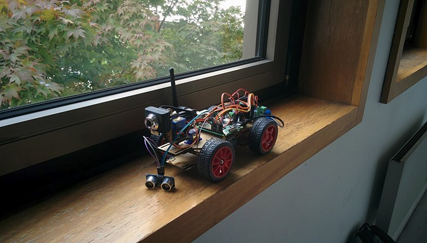

# Autonomous Remote Controlled Car

## Objective
The goal of this project was to build an autonomous remote controlled car using deep learning.
The car is embedded with a Raspberry Pi and a Convolutional Neural Network (CNN) to predict in real-time the speed and the steering angle. We used an ultrasonic sensor to stop the car when encountering obstacles and another CNN for detecting stop signs.

## Caution
This repository aims at giving a sample project for building a self driving rc car.
The logic for the client-server is only working with the hardware used for this experiment.
We highly advise you to understand the `smartcar\learn` module for knowing how to train the model
and the `smartcar\server\auto_drive.py` file for the autonomous driving logic.

## Hardware
We used the [SunFounder PiCar-S Kit V2.0 for Raspberry Pi with Raspberry Pi 4B and TF card](https://www.sunfounder.com/picars-kit-with-raspberrypi.html) for the hardware. It costs around 180$ and can be built in an hour or two.
